

## Отчет

## Практическая работа 4

## Работа с встроенной базой данных SQLite

---

**ФИО:** Лапшин Никита Евгеньевич  
**Курс:** 2
**Группа:** ИНС-б-о-24-1  
**Направление:** 09.03.02 «Информационные системы и технологии»  

---
### Вариант 9
### Цель работы

Изучить основы работы с СУБД SQLite в Android-приложениях. Научиться создавать базу данных, таблицы, выполнять основные операции CRUD (Create, Read, Update, Delete) с использованием класса SQLiteOpenHelper и отображать данные на экране.
### Ход работы

  
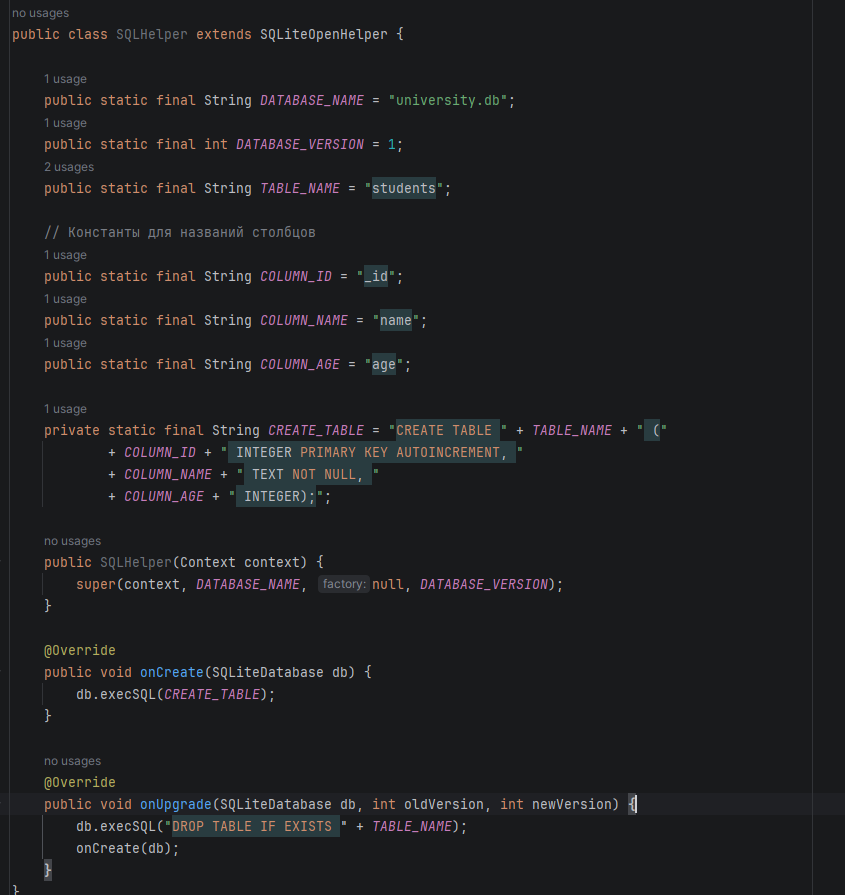

Рисунок 1 - Создание класса SQLHelper

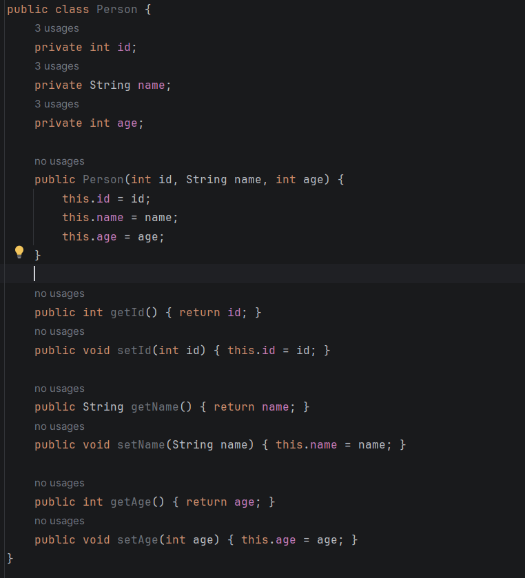

Рисунок 2 - Создание класса Person

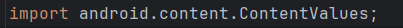

Рисунок 3 – Импорт ContentValues

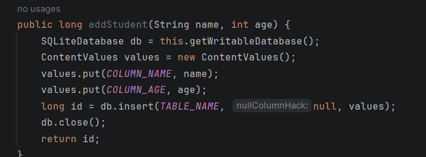

Рисунок 4 – Добавление студента

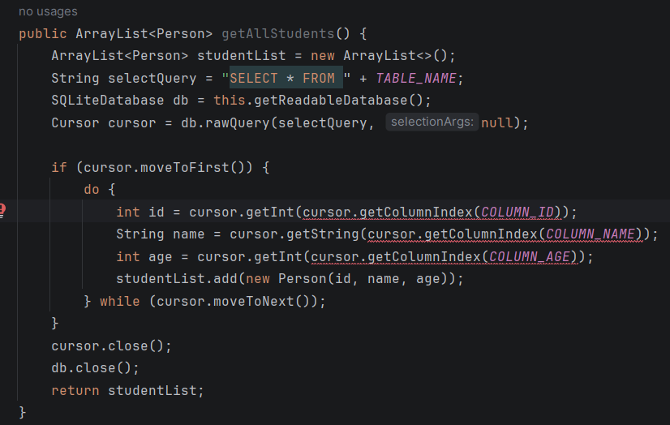

Рисунок 5 – Формирование SQL запроса

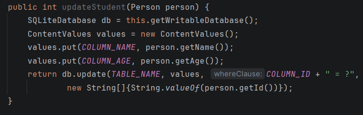

Рисунок 6 – Обновление данных студента

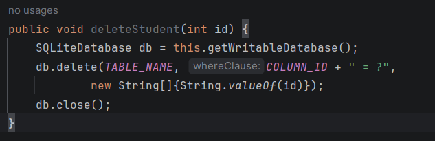

Рисунок 7 – Удаление студента

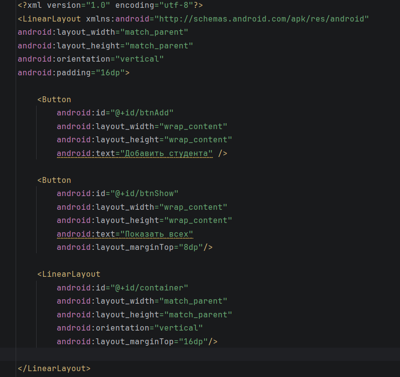

Рисунок 8 – XML файл с кнопками

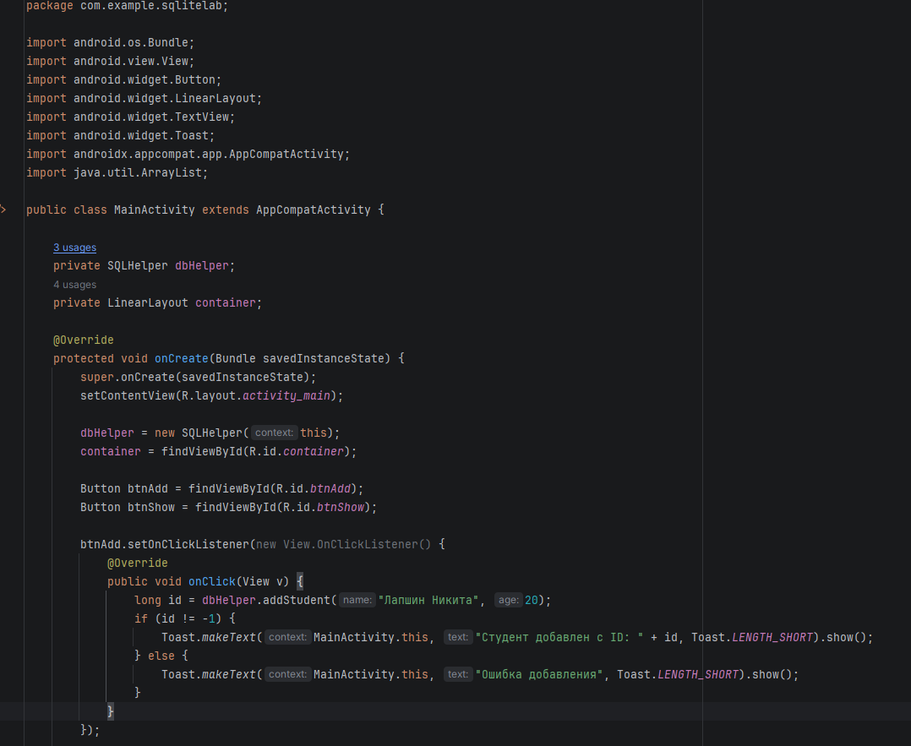

Рисунок 9 – Логика нажатия с добавлением заранее заготовленного шаблома студента

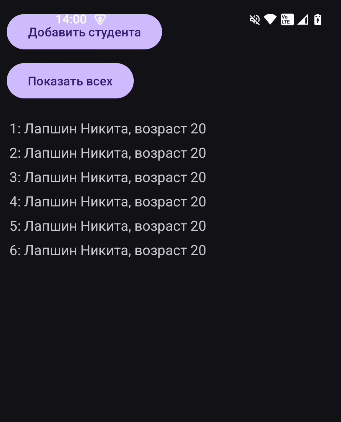

Рисунок 10 – Демонстрация  кода

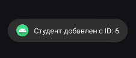

Рисунок 11 – Вывод Toast

## Индивидуальное задание

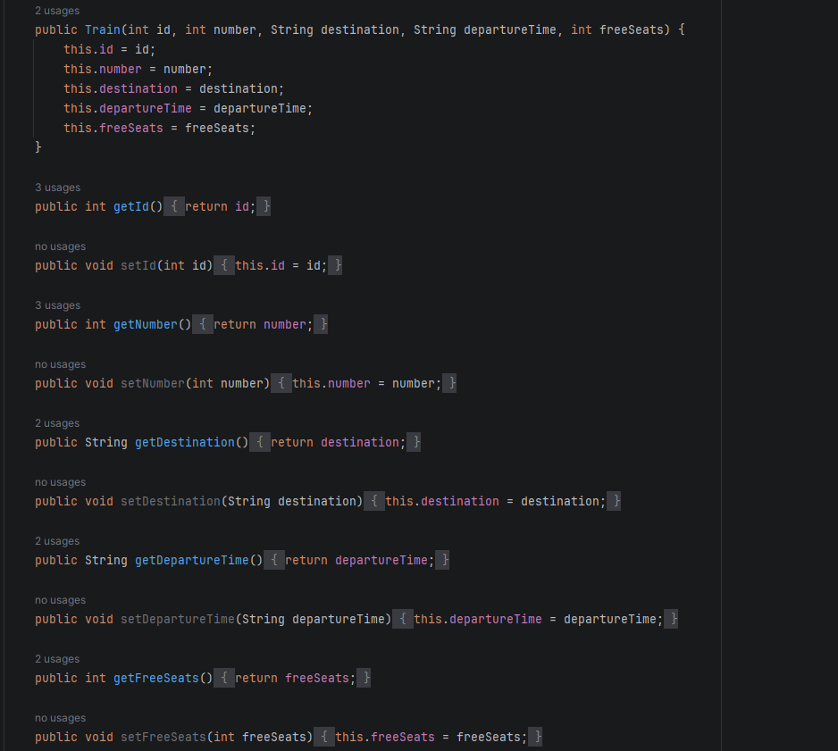

Рисунок 12 – Класс person для хранения данных о поезде

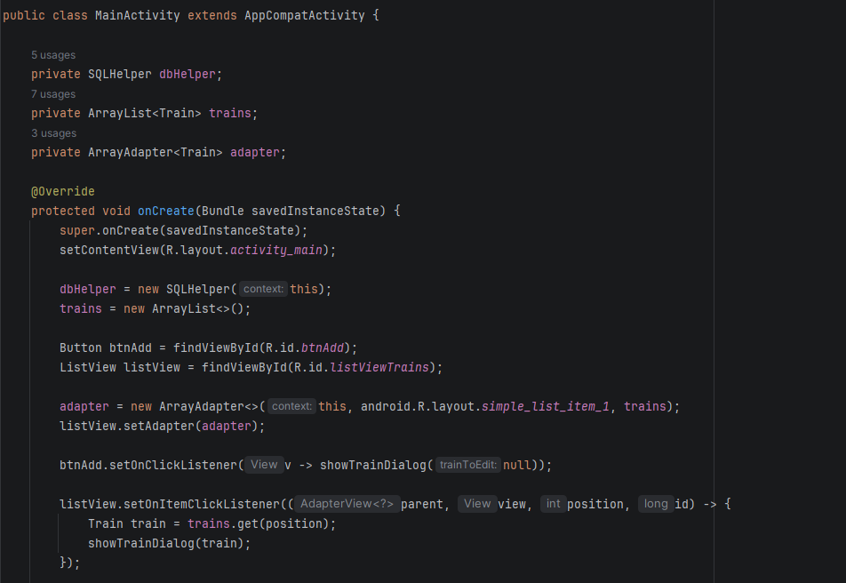

Рисунок 13 – Класс MainActivity

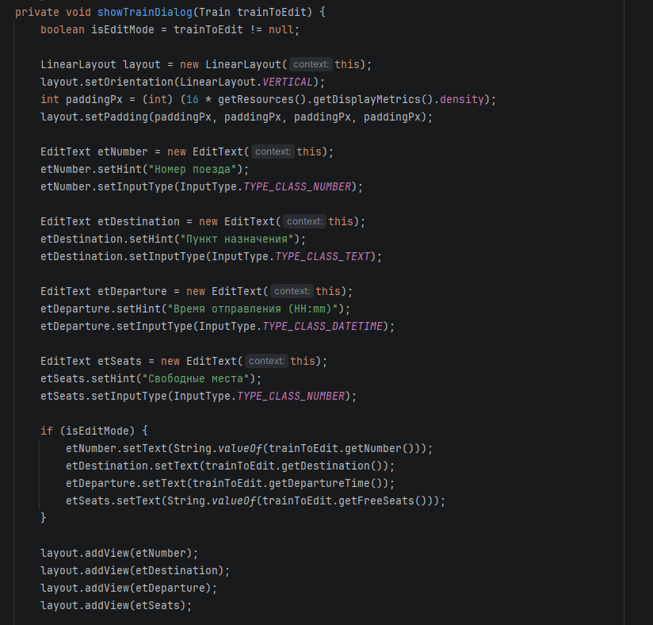

Рисунок 14 – Диалоговое окно для создания расписания

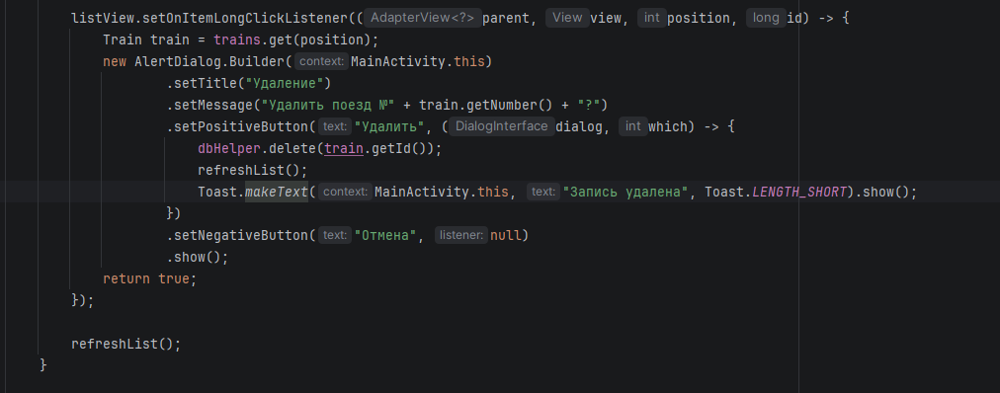

Рисунок 15 – Удаление записи

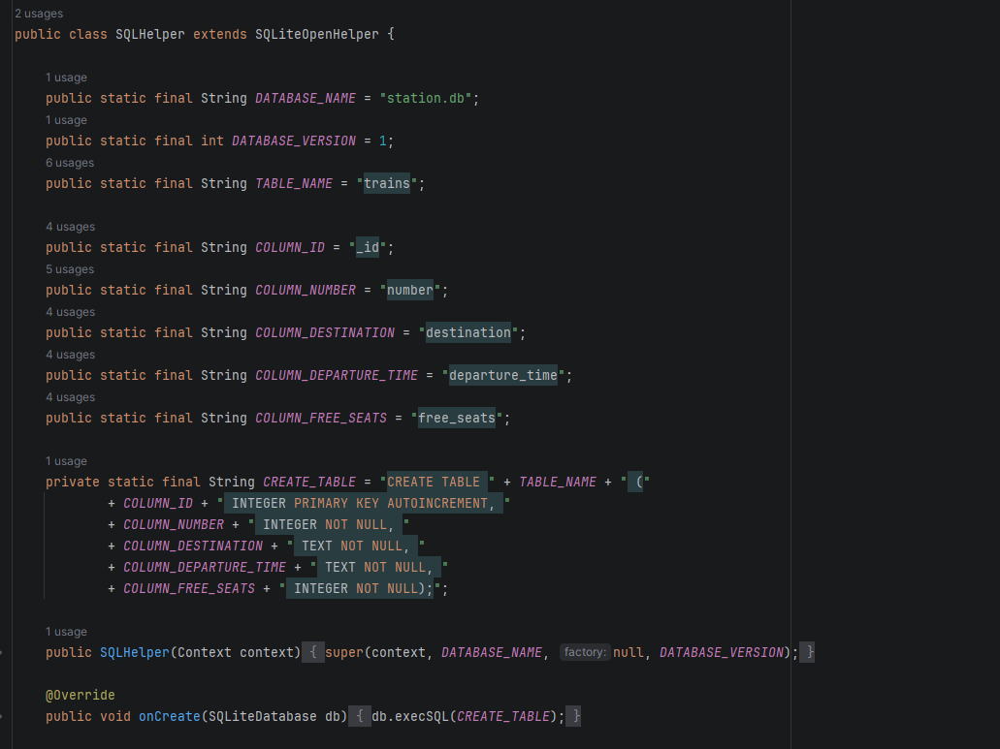

Рисунок 16 – Класс SQLHelper

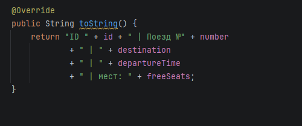

Рисунок 17 – Строковое представление объекта поезда

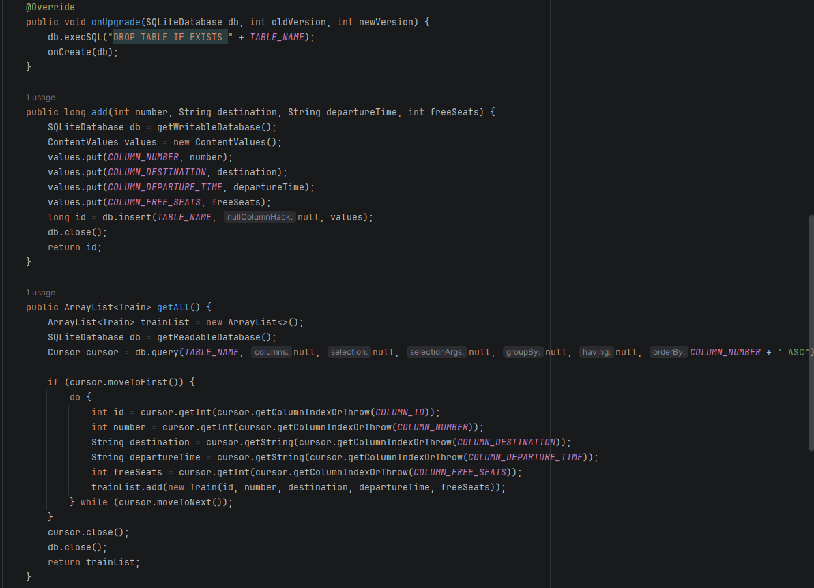

Рисунок 18 – Обновление списка, добавление и получене всех поездов

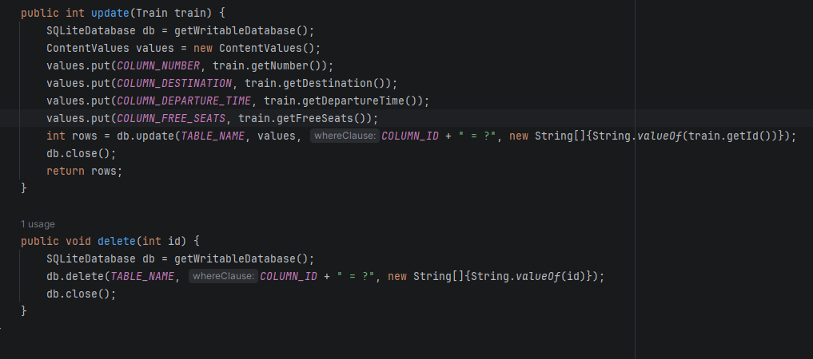

Рисунок 19 – Обновление данных поезда и удаление 

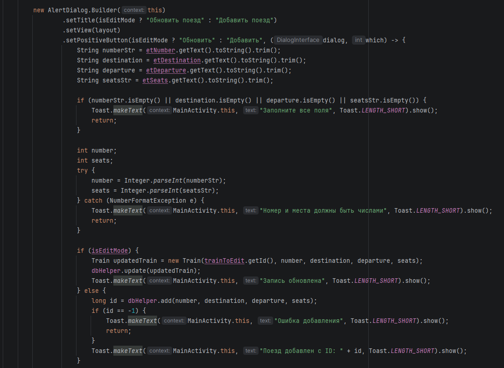

Рисунок 20 – Диалоговое окно добавления и обнавления рейсов / Вывод Toast-сообщений

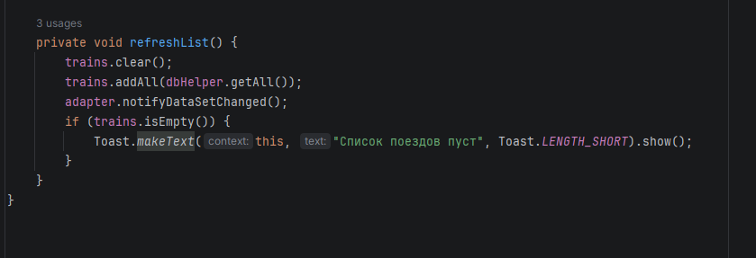

Рисунок 21 – Обновления списка / Проверка на пустой список

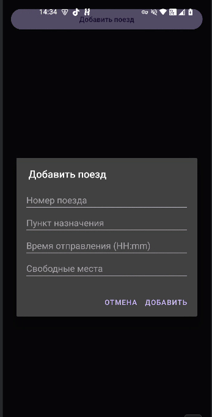

Рисунок 22 – Диалоговое окно добавления рейсов

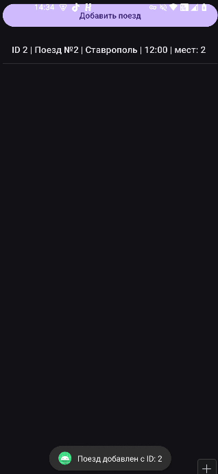

Рисунок 23 – Список рейсов

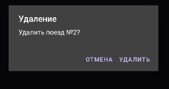

Рисунок 24 – Удаление рейса

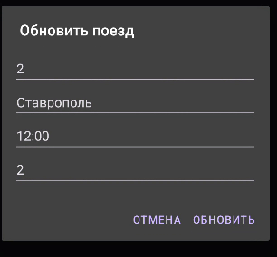

Рисунок 25 – Обновление рейса

